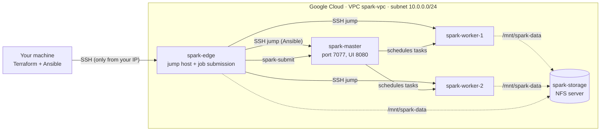
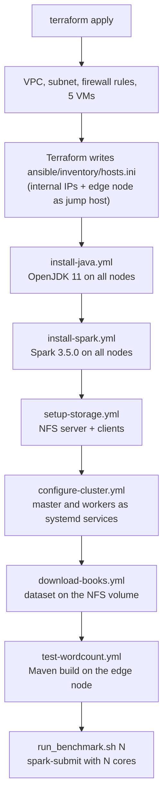
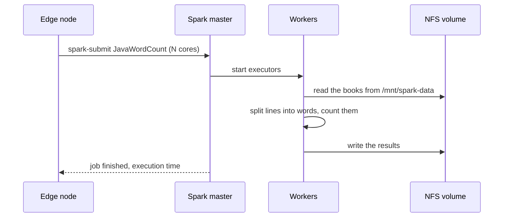

# spark-cluster-gcp

Automated deployment of an Apache Spark cluster on Google Cloud, from empty project to a running benchmark.

Terraform creates the network, the firewall rules and the virtual machines, then writes the Ansible inventory itself. Ansible installs Java and Spark, starts the master and the workers as services, and mounts a shared NFS volume. A Java WordCount job validates the cluster.

## What it does

- **Provision:** a VPC, a subnet, firewall rules and 5 VMs (master, 2 workers by default, edge node, storage node) with Terraform.
- **Connect:** the edge node is the only machine open to SSH, and only from your IP. Ansible reaches the other nodes through it (jump host).
- **Configure:** OpenJDK 11, Spark 3.5.0 and systemd services for the master and the workers, with reusable Ansible roles.
- **Share data:** the storage node exports an NFS volume mounted on every node, so datasets are downloaded once.
- **Validate:** a Java WordCount, built with Maven on the edge node, is submitted to the cluster and timed with different numbers of cores.

## Architecture



| Node | Role |
|---|---|
| `spark-edge` | Only SSH entry point (firewall tag `edge-node`), builds and submits the jobs |
| `spark-master` | Spark master: receives jobs and schedules them on the workers |
| `spark-worker-N` | Run the executors. The number is a Terraform variable (`worker_count`) |
| `spark-storage` | NFS server exporting the shared data directory |

**Firewall rules:** SSH only to the edge node and only from your IP, Spark ports (7077, 8080, 8081, 4040) only from your IP, and all traffic allowed between nodes inside the subnet.

## Deployment pipeline



Generating the inventory from Terraform means no IP address is ever copied by hand: destroy and recreate the cluster, and Ansible still finds every node.

## How a job runs



## Results

WordCount on 10 classic novels from Project Gutenberg:

| Cores | Execution time |
|---|---|
| 1 | 28 s |
| 2 | 19 s |
| 4 | 19 s |

Going from 1 to 2 cores cuts the time by about a third. Beyond that, the small dataset and the NFS reads become the bottleneck, so more cores bring nothing. The `download-books.yml` playbook can also build a larger file (around 300 MB) for heavier tests.

## Project structure

```
terraform/
  main.tf              # VPC, subnet, firewall rules, VMs
  variables.tf         # project, region, worker count, machine type, your IP
  outputs.tf           # IPs, Spark UI URL, generated Ansible inventory
ansible/
  playbooks/           # one playbook per step, run in the order above
  roles/               # java, spark-common, spark-master, spark-worker, nfs-server, nfs-client
scripts/
  start_tunnel.sh      # SSH tunnel through the edge node to open the Spark UI locally
tests/
  wordcount-java/      # Java WordCount (Maven)
  wordcount/run_benchmark.sh
rapport.pdf            # project report
```

## Getting started

**Prerequisites:** a GCP project, a service account key saved as `gcp-credentials.json` at the root (ignored by git, never commit it), Terraform, Ansible and the gcloud CLI.

```bash
# 1. Infrastructure
cd terraform
terraform init
terraform apply -var="project_id=<your-project>" -var="my_ip=<your-ip>/32" -var="ansible_user=<your-os-login-user>"

# 2. Configuration
cd ../ansible
ansible-playbook -i inventory/hosts.ini playbooks/install-java.yml
ansible-playbook -i inventory/hosts.ini playbooks/install-spark.yml
ansible-playbook -i inventory/hosts.ini playbooks/setup-storage.yml
ansible-playbook -i inventory/hosts.ini playbooks/configure-cluster.yml
ansible-playbook -i inventory/hosts.ini playbooks/download-books.yml
ansible-playbook -i inventory/hosts.ini playbooks/test-wordcount.yml

# 3. Spark UI on http://localhost:8080
../scripts/start_tunnel.sh

# 4. Benchmark, from the edge node
./run_benchmark.sh 2
```

## What I learned

Building infrastructure as code end to end, separating provisioning (Terraform) from configuration (Ansible), generating the inventory instead of copying IPs by hand, reaching private machines through a jump host, and reading a benchmark to find the real bottleneck.

## Context

Team project, ENSEEIHT, Infrastructure and Big Data major. Built with @MEKKAOUIOssamaMoussa.
